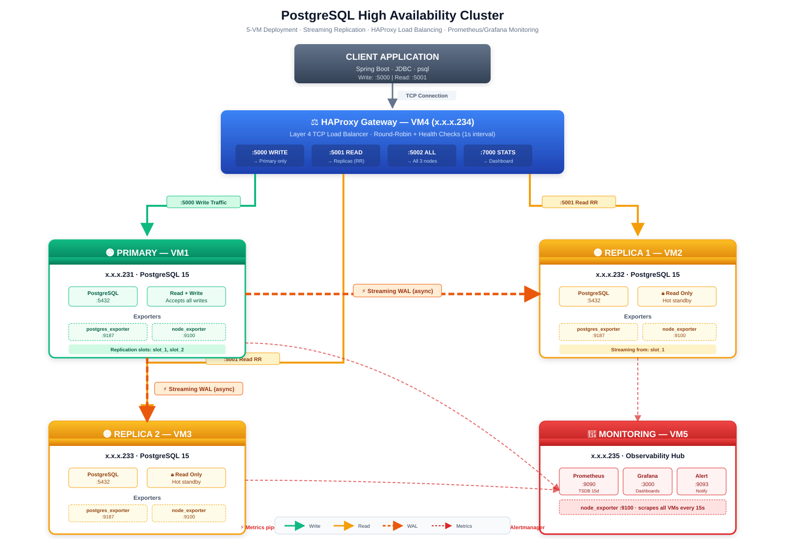

# PostgreSQL High Availability Cluster

Production-grade PostgreSQL HA cluster with streaming replication, HAProxy load balancing, and Prometheus/Grafana monitoring across 5 VMs.

## Architecture




### Component Roles

| VM | IP | Role | Services |
|---|---|---|---|
| VM1 | x.x.x.231 | Primary | PostgreSQL + exporters |
| VM2 | x.x.x.232 | Replica1 | PostgreSQL + exporters |
| VM3 | x.x.x.233 | Replica2 | PostgreSQL + exporters |
| VM4 | x.x.x.234 | HAProxy | HAProxy + node-exporter |
| VM5 | x.x.x.235 | Monitoring | Prometheus + Grafana + Alertmanager |

---

## Prerequisites

- 5 × Ubuntu 22.04/24.04 VMs (2 CPU, 4 GB RAM, 20 GB disk minimum)
- Same network, low latency between VMs
- Root or sudo access on all VMs
- Internet access (for Docker image pulls)

---

## Step 1 — VM Preparation

**Run these commands on ALL 5 VMs (231, 232, 233, 234, 235).**

### 1.1 Install make

```bash
sudo apt update
sudo apt install -y make
make --version

```

### 1.2 Docker group permissions

```bash
sudo apt install -y docker.io make
sudo groupadd --force docker
sudo usermod -aG docker $USER
newgrp docker

```

**Verify:**

```bash
docker compose version
docker ps
# Should not show "permission denied"
```

> If still permission denied, log out and log back in.

### 1.3 Install Docker Compose plugin

Ubuntu's `docker.io` does not ship the Compose plugin — install manually.

```bash
# Detect architecture
ARCH=$(uname -m)
echo "Arch: $ARCH"
```

**For x86_64:**

```bash
sudo curl -SL "https://github.com/docker/compose/releases/latest/download/docker-compose-linux-x86_64" \
  -o /usr/libexec/docker/cli-plugins/docker-compose
```

**For aarch64:**

```bash
sudo curl -SL "https://github.com/docker/compose/releases/latest/download/docker-compose-linux-aarch64" \
  -o /usr/libexec/docker/cli-plugins/docker-compose
```

**Make executable and verify:**

```bash
sudo chmod +x /usr/libexec/docker/cli-plugins/docker-compose
docker compose version
# Expected: Docker Compose version v2.x.x
```

### 1.4 Enable Docker daemon

```bash
sudo systemctl enable docker
sudo systemctl start docker
sudo systemctl status docker --no-pager
# Expected: active (running)
```

### 1.5 Configure firewall (per VM role)

**VM1 — Primary (x.x.x.231):**

```bash
sudo ufw allow 22/tcp
sudo ufw allow 5432/tcp
sudo ufw allow 9100/tcp
sudo ufw allow 9187/tcp
sudo ufw --force enable
```

**VM2 — Replica1 (x.x.x.232):**

```bash
sudo ufw allow 22/tcp
sudo ufw allow 5432/tcp
sudo ufw allow 9100/tcp
sudo ufw allow 9187/tcp
sudo ufw --force enable
```

**VM3 — Replica2 (x.x.x.233):**

Same as VM2.

**VM4 — HAProxy (x.x.x.234):**

```bash
sudo ufw allow 22/tcp
sudo ufw allow 5000/tcp
sudo ufw allow 5001/tcp
sudo ufw allow 5002/tcp
sudo ufw allow 7000/tcp
sudo ufw allow 9100/tcp
sudo ufw --force enable
```

**VM5 — Monitoring (x.x.x.235):**

```bash
sudo ufw allow 22/tcp
sudo ufw allow 9090/tcp
sudo ufw allow 3000/tcp
sudo ufw allow 9093/tcp
sudo ufw allow 9100/tcp
sudo ufw --force enable
```

### 1.6 Verify VM preparation

```bash
make --version
docker --version
docker compose version
sudo ufw status | head -5
```

All working → VM is ready.

---

## Step 2 — Clone Repository

**On each VM:**

```bash
cd ~
git clone <your-repo-url> postgres-ha-cluster
cd postgres-ha-cluster
```

**Make scripts executable:**

```bash
chmod +x scripts/replica/entrypoint.sh 2>/dev/null || true
```

---

## Step 3 — Configuration

### 3.1 Copy `.env` file

**On each VM, copy the same `.env.example` file:**

```bash
cd ~/postgres-ha-cluster
cp .env.example .env 

```

---

## Step 4 — Deploy VM1 (Primary)

**On VM1 (x.x.x.231):**

```bash
make up-primary
make status-primary
make logs-primary

```

**Verify:**

```bash
docker exec postgres-primary pg_isready -U postgres
# Expected: accepting connections

docker exec postgres-primary psql -U postgres -c \
  "SELECT slot_name, active FROM pg_replication_slots;"
# Expected: 2 slots, active=f
```

---

## Step 5 — Deploy VM2 (Replica1)

**On VM2 (x.x.x.232):**

```bash
make up-replica1
make status-replica1
make logs-replica1
```

**Expected log lines:**

```
>>> Waiting for primary at x.x.x.231:5432...
>>> Running pg_basebackup (slot=replication_slot_1)...
>>> Starting replica in standby mode...
LOG:  started streaming WAL from primary
```

**Verify:**

```bash
docker exec postgres-replica1 psql -U postgres -c "SELECT pg_is_in_recovery();"
# Expected: t
```

---

## Step 6 — Deploy VM3 (Replica2)

**On VM3 (x.x.x.233):**

```bash
make up-replica2
make status-replica2
make logs-replica2
```

**Verify:**

```bash
docker exec postgres-replica2 psql -U postgres -c "SELECT pg_is_in_recovery();"
# Expected: t
```

**Check replication on Primary (VM1):**

```bash
docker exec postgres-primary psql -U postgres -c \
  "SELECT client_addr, state, sync_state FROM pg_stat_replication;"
```

**Expected:**

```
 client_addr  |   state   | sync_state
--------------+-----------+------------
 x.x.x.232 | streaming | async
 x.x.x.233 | streaming | async
(2 rows)
```

---

## Step 7 — Deploy VM4 (HAProxy)

**On VM4 (x.x.x.234):**

```bash
make up-haproxy
make status-haproxy
make logs-haproxy

```

**Expected:**

```
[NOTICE]   (1) : haproxy version is 2.8.x
[NOTICE]   (1) : New worker (8) forked
[NOTICE]   (1) : Loading success.
```

**Verify backends:**

```bash
curl -s http://localhost:7000 | grep -oE '(pg_primary|pg_replicas|pg_all_nodes)' | sort -u
```

**Browser:** `http://x.x.x.234:7000` → All backends UP (green)

---

## Step 8 — Deploy VM5 (Monitoring)

**On VM5 (x.x.x.235):**

```bash
make up-monitoring
make status-monitoring
make logs-monitoring

```

**Verify Prometheus targets:**

```bash
curl -s http://localhost:9090/api/v1/targets | \
  jq -r '.data.activeTargets[] | "\(.labels.job) \(.labels.instance) → \(.health)"'
```

**Expected — all UP:**

```
node x.x.x.231:9100 → up
node x.x.x.232:9100 → up
node x.x.x.233:9100 → up
node x.x.x.234:9100 → up
node x.x.x.235:9100 → up
postgres x.x.x.231:9187 → up
postgres x.x.x.232:9187 → up
postgres x.x.x.233:9187 → up
```

### 8.1 Grafana setup

**Browser:** `http://x.x.x.235:3000` → login (admin / admin → change on first login)

**Add Prometheus datasource:**

- Menu → **Connections** → **Data sources**
- **Prometheus** → URL: `http://x.x.x.235:9090`
- **Save & Test** → "Data source is working"

**Import dashboards:**

- Menu → **Dashboards** → **Import**
- ID `9628` (PostgreSQL Database) → Import
- ID `1860` (Node Exporter Full) → Import

---

## Step 9 — Testing

### 9.1 Basic connectivity

**From your laptop:**

```bash
# Install psql client
sudo apt install -y postgresql-client

# Test write endpoint
PGPASSWORD='ChangeMeStrong123!' psql -h x.x.x.234 -p 5000 -U postgres -d mydb \
  -c "SELECT pg_is_in_recovery();"
# Expected: f  (primary)
```

### 9.2 Write test

```bash
PGPASSWORD='ChangeMeStrong123!' psql -h x.x.x.234 -p 5000 -U postgres -d mydb \
  -c "INSERT INTO test_replication (data) VALUES ('test ' || now());"
# Expected: INSERT 0 1
```

### 9.3 Read test (round-robin)

```bash
for i in 1 2 3 4; do
  echo -n "Request $i → "
  PGPASSWORD='ChangeMeStrong123!' psql -h x.x.x.234 -p 5001 -U postgres -d mydb \
    -t -A -c "SELECT inet_server_addr() || ' | is_replica=' || pg_is_in_recovery();"
done
```

**Expected — two different IPs alternating:**

```
Request 1 → x.x.x.232/32 | is_replica=true
Request 2 → x.x.x.233/32 | is_replica=true
Request 3 → x.x.x.232/32 | is_replica=true
Request 4 → x.x.x.233/32 | is_replica=true
```

### 9.4 Read-only verification

```bash
PGPASSWORD='ChangeMeStrong123!' psql -h x.x.x.234 -p 5001 -U postgres -d mydb \
  -c "INSERT INTO test_replication (data) VALUES ('should fail');"
# Expected: ERROR: cannot execute INSERT in a read-only transaction
```

### 9.5 Failover test

```bash
# Stop Replica1
ssh x@x.x.x.232 "docker stop postgres-replica1"
sleep 4

# All reads should go to Replica2
for i in 1 2 3; do
  echo -n "Request $i → "
  PGPASSWORD='pass' psql -h x.x.x.234 -p 5001 -U postgres -d mydb \
    -t -A -c "SELECT inet_server_addr();"
done

# Restart Replica1
ssh x@x.x.x.232 "docker start postgres-replica1"
```

### 9.6 Full automated test suite

**Create the test script on your laptop:**

```bash
cat > ~/test-ha-cluster.sh <<'SCRIPT_EOF'
#!/bin/bash
PGHOST=x.x.x.234
PGUSER=postgres
PGPASS='pass'
PGDB=mydb
PASS=0; FAIL=0

ok()  { echo -e "  $1"; PASS=$((PASS+1)); }
bad() { echo -e "  $1"; FAIL=$((FAIL+1)); }
PG()  { PGPASSWORD="$PGPASS" psql -h "$PGHOST" -p "$1" -U "$PGUSER" -d "$PGDB" "${@:2}"; }

echo "=== 1. Ports ==="
for p in 5000 5001 5002 7000; do
  nc -z -w2 $PGHOST $p 2>/dev/null && ok "Port $p" || bad "Port $p"
done

echo "=== 2. HAProxy Stats ==="
[ "$(curl -s -o /dev/null -w '%{http_code}' http://$PGHOST:7000/)" = "200" ] \
  && ok "Stats UI" || bad "Stats UI"

echo "=== 3. Write → Primary ==="
[ "$(PG 5000 -t -A -c 'SELECT pg_is_in_recovery();')" = "f" ] \
  && ok "Write to primary" || bad "Write to primary"

echo "=== 4. Read → Replica ==="
[ "$(PG 5001 -t -A -c 'SELECT pg_is_in_recovery();')" = "t" ] \
  && ok "Read from replica" || bad "Read from replica"

echo "=== 5. Round-robin ==="
IP1=$(PG 5001 -t -A -c 'SELECT inet_server_addr();')
IP2=$(PG 5001 -t -A -c 'SELECT inet_server_addr();')
[ "$IP1" != "$IP2" ] && ok "Round-robin works" || bad "Round-robin failed"

echo "=== 6. Read-only ==="
PG 5001 -c "INSERT INTO test_replication (data) VALUES ('fail');" 2>&1 | \
  grep -q "read-only" && ok "Read-only enforced" || bad "Read-only failed"

echo ""
echo "Passed: $PASS  |  Failed: $FAIL"
SCRIPT_EOF

chmod +x ~/test-ha-cluster.sh
~/test-ha-cluster.sh
```

---

## Step 10 — Monitoring URLs

| Service | URL | Credentials |
|---|---|---|
| HAProxy Stats | `http://x.x.x.234:7000` | none |
| Prometheus | `http://x.x.x.235:9090` | none |
| Grafana | `http://x.x.x.235:3000` | admin/admin |
| Alertmanager | `http://x.x.x.235:9093` | none |
| Prometheus Targets | `http://x.x.x.235:9090/targets` | none |

---

## Application Connection

```yaml
# Spring Boot
spring:
  datasource:
    write:
      url: jdbc:postgresql://x.x.x.234:5000/mydb
      username: postgres
      password: pass
    read:
      url: jdbc:postgresql://x.x.x.234:5001/mydb
      username: postgres
      password: pass
```

| Endpoint | Purpose |
|---|---|
| `x.x.x.234:5000` | Write (Primary) |
| `x.x.x.234:5001` | Read (Replica round-robin) |
| `x.x.x.234:5002` | All nodes |
| `x.x.x.234:7000` | HAProxy Stats |

---

## Common Operations

### Restart a service

```bash
# VM1
cd ~/postgres-ha-cluster/docker-compose/primary
docker compose --env-file ../../.env restart
```

### View logs

```bash
# Primary
ssh x@x.x.x.231 "docker logs -f postgres-primary"

# HAProxy
ssh x@x.x.x.234 "docker logs -f haproxy"

# Prometheus
ssh x@x.x.x.235 "docker logs -f prometheus"
```

### Check replication status

```bash
ssh x@x.x.x.231 "docker exec postgres-primary psql -U postgres -c \
  'SELECT client_addr, state, sync_state, replay_lag FROM pg_stat_replication;'"
```

### Reset a replica

```bash
# On VM2 (or VM3)
cd ~/postgres-ha-cluster/docker-compose/replica1
docker compose --env-file ../../.env down -v
docker compose --env-file ../../.env up -d
docker logs -f postgres-replica1
```

### Backup primary

```bash
ssh x@x.x.x.231 "docker exec postgres-primary pg_dump -U postgres mydb | gzip > /tmp/mydb-\$(date +%Y%m%d).sql.gz"
```

---

## Troubleshooting

### Replica fails with "password authentication failed"

**Cause:** `init.sql` password ≠ `.env` `REPLICATOR_PASSWORD`.

**Fix (on VM1):**

```bash
source ~/postgres-ha-cluster/.env
docker exec postgres-primary psql -U postgres -c \
  "ALTER ROLE replicator WITH PASSWORD '$REPLICATOR_PASSWORD';"
```

Then restart replicas:

```bash
ssh vm@10.70.16.232 "docker restart postgres-replica1"
ssh vm@10.70.16.233 "docker restart postgres-replica2"
```

### HAProxy shows Usage output and restarts

**Cause:** `config/haproxy/haproxy.cfg` is a directory (Docker created it), not a file.

**Fix (on VM4):**

```bash
cd ~/postgres-ha-cluster/docker-compose/haproxy
docker compose --env-file ../../.env down

cd ~/postgres-ha-cluster
sudo rm -rf config/haproxy/haproxy.cfg
# Recreate the file with proper content
printf '\n' >> config/haproxy/haproxy.cfg

docker compose --env-file ./docker-compose/haproxy/docker-compose.yml up -d
```

### HAProxy backends show DOWN

**Cause:** Health check fails or backends unreachable.

**Fix:**

```bash
# On VM4, test reachability
nc -zv x.x.x.231 5432
nc -zv x.x.x.232 5432
nc -zv x.x.x.233 5432
```

If unreachable → check UFW on target VM.

### Grafana: "connection refused to localhost:9090"

**Cause:** Grafana container uses `localhost` internally.

**Fix:** Change datasource URL to `http://x.x.x.235:9090`.

### Prometheus target DOWN

```bash
# On VM5
docker logs prometheus | grep <target-ip>
```

If firewall → open port 9100/9187 on target VM.

### `make` not found

```bash
sudo apt install -y make
```

### `docker compose` not found

```bash
sudo curl -SL "https://github.com/docker/compose/releases/latest/download/docker-compose-linux-x86_64" \
  -o /usr/libexec/docker/cli-plugins/docker-compose
sudo chmod +x /usr/libexec/docker/cli-plugins/docker-compose
docker compose version
```

---

## Verification Checklist

```
[ ] All 5 VMs prepared (docker, make, compose)
[ ] .env created on all VMs
[ ] init.sql password synced with .env
[ ] VM1: postgres-primary healthy
[ ] VM1: 2 replication slots exist
[ ] VM2: postgres-replica1 streaming
[ ] VM3: postgres-replica2 streaming
[ ] VM1: pg_stat_replication shows 2 streaming
[ ] VM4: HAProxy running (Loading success)
[ ] VM4: All 3 backends UP in stats
[ ] VM5: Prometheus scraping all targets
[ ] VM5: Grafana dashboards imported
[ ] Write test succeeds (port 5000)
[ ] Read test round-robins (port 5001)
[ ] Read-only enforced on replicas
[ ] Failover works (stop replica → other takes over)
```

---

## Repository Structure

```
postgres-ha-cluster/
├── README.md
├── .env.example
├── Makefile
│
├── config/
│   ├── postgres/
│   │   ├── primary/
│   │   │   ├── postgresql.conf
│   │   │   └── pg_hba.conf
│   │   └── replica/
│   │       └── postgresql.conf
│   ├── haproxy/
│   │   └── haproxy.cfg
│   ├── prometheus/
│   │   ├── prometheus.yml
│   │   └── alerts.yml
│   ├── alertmanager/
│   │   └── alertmanager.yml
│   └── grafana/
│       └── provisioning/
│           ├── datasources/
│           │   └── prometheus.yml
│           └── dashboards/
│               └── dashboard.yml
│
├── scripts/
│   ├── primary/
│   │   └── init.sql
│   └── replica/
│       └── entrypoint.sh
│
└── docker-compose/
    ├── primary/
    │   └── docker-compose.yml
    ├── replica1/
    │   └── docker-compose.yml
    ├── replica2/
    │   └── docker-compose.yml
    ├── haproxy/
    │   └── docker-compose.yml
    └── monitoring/
        └── docker-compose.yml
```

---

## Support

For issues, open a GitHub issue with:

- Output of `docker ps -a` on affected VM
- Output of `docker logs <container> --tail 50`
- Relevant firewall status: `sudo ufw status`

---

## License

MIT
